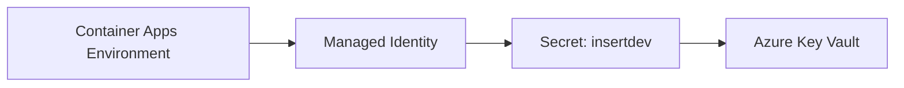

# Azure Container Apps Environment Access to a Single Key Vault Certificate

## Overview

This guide describes how to configure an Azure Container Apps Environment to import a certificate from Azure Key Vault while following the principle of least privilege.

The solution grants the Container Apps Environment managed identity access to **only a single certificate's backing secret** rather than granting access to all secrets or certificates stored in the Key Vault.

## Architecture



## Prerequisites

- Azure Container Apps Environment already exists.
- Azure Key Vault already exists.
- Certificate already exists in the Key Vault.
- Key Vault is configured to use **Azure RBAC** authorization.

---

## 1. Verify Key Vault Uses Azure RBAC

Verify that the Key Vault uses the Azure RBAC permission model instead of legacy access policies.

```bash
az keyvault show \
  --name insert-kv-test \
  --query properties.enableRbacAuthorization
```

Expected output:

```text
true
```

---

## 2. Enable a System-Assigned Managed Identity

Enable a system-assigned managed identity on the Container Apps Environment.

```bash
az containerapp env identity assign \
  --name moria-tests-dashboard-aca-env-test \
  --resource-group moria-tests-dashboard-rg-test \
  --system-assigned
```

Retrieve the principal ID:

```bash
ACA_PRINCIPAL_ID=$(az containerapp env show \
  --name moria-tests-dashboard-aca-env-test \
  --resource-group moria-tests-dashboard-rg-test \
  --query identity.principalId \
  -o tsv)

echo $ACA_PRINCIPAL_ID
```

Example output:

```text
5c6626eb-be98-4199-9d6b-3ca5002b9896
```

---

## 3. Verify the Certificate's Backing Secret

Every Key Vault certificate has a corresponding secret containing the certificate's PFX payload.

Retrieve the secret identifier associated with the certificate:

```bash
az keyvault certificate show \
  --vault-name insert-kv-test \
  --name insertdev \
  --query sid \
  -o tsv
```

Example output:

```text
https://insert-kv-test.vault.azure.net/secrets/insertdev/xxxxxxxxxxxxxxxx
```

The secret name in this example is:

```text
insertdev
```

---

## 4. Grant Access to Only the Certificate Secret

Assign the **Key Vault Secrets User** role directly to the certificate's backing secret.

```bash
az role assignment create \
  --assignee-object-id $ACA_PRINCIPAL_ID \
  --assignee-principal-type ServicePrincipal \
  --role "Key Vault Secrets User" \
  --scope "/subscriptions/ff1c7a90-5d9f-4840-a9e5-d4954c25f078/resourceGroups/shared-resources-rg-test/providers/Microsoft.KeyVault/vaults/insert-kv-test/secrets/insertdev"
```

This grants only:

```text
Microsoft.KeyVault/vaults/secrets/getSecret/action
Microsoft.KeyVault/vaults/secrets/readMetadata/action
```

No additional access to:

- Other secrets
- Other certificates
- Keys
- The Key Vault as a whole

---

## 5. Import the Certificate into the Container Apps Environment

Import the certificate from Key Vault.

```bash
az containerapp env certificate upload \
  --resource-group moria-tests-dashboard-rg-test \
  --name moria-tests-dashboard-aca-env-test \
  --akv-url https://insert-kv-test.vault.azure.net/certificates/insertdev
```

---

## 6. Verify Permissions

Verify the role assignment.

```bash
az role assignment list \
  --assignee $ACA_PRINCIPAL_ID \
  --all \
  --output table
```

Expected output:

```text
Role                  Scope
--------------------  -------------------------------------------------------------------------
Key Vault Secrets User .../vaults/insert-kv-test/secrets/insertdev
```

---

## Troubleshooting

### Error

```text
Failed to import Key Vault certificate: insertdev.

The Managed Identity 'system' does not have permission for resource:

https://insert-kv-test.vault.azure.net/secrets/insertdev
```

### Cause

Azure Container Apps performs authorization against the certificate's backing **secret** rather than the certificate resource itself.

### Resolution

Grant the managed identity access to:

```text
/vaults/<key-vault>/secrets/<certificate-name>
```

using the **Key Vault Secrets User** role.

---

## Important Finding

The following configuration was tested and found to be insufficient on its own:

```bash
az role assignment create \
  --assignee-object-id $ACA_PRINCIPAL_ID \
  --assignee-principal-type ServicePrincipal \
  --role "Key Vault Certificate User" \
  --scope "/subscriptions/ff1c7a90-5d9f-4840-a9e5-d4954c25f078/resourceGroups/shared-resources-rg-test/providers/Microsoft.KeyVault/vaults/insert-kv-test/certificates/insertdev"
```

Although the role includes permissions to read the backing secret, the scope is bound to:

```text
.../certificates/insertdev
```

whereas Azure Container Apps performs authorization checks against:

```text
.../secrets/insertdev
```

As a result, the certificate-scoped role assignment does not satisfy the authorization check required during certificate import.

> Warning
>
> Do not assume that assigning **Key Vault Certificate User** on an individual certificate is enough for Azure Container Apps certificate import.
>
> Azure Container Apps ultimately accesses the backing Key Vault secret and requires authorization on that resource.

---

## Recommended Final Configuration

### Minimum Required Permission

```text
Role:
    Key Vault Secrets User

Scope:
    /subscriptions/<subscription-id>/resourceGroups/<resource-group>/providers/Microsoft.KeyVault/vaults/<key-vault-name>/secrets/<certificate-secret-name>
```

### Benefits

✅ Access to exactly one certificate

✅ No access to other certificates

✅ No access to other secrets

✅ No Key Vault-wide permissions

✅ Least-privilege RBAC model

✅ Works with Azure Container Apps certificate import

---

## References

- https://learn.microsoft.com/azure/container-apps/key-vault-certificates-manage
- https://learn.microsoft.com/azure/key-vault/general/rbac-guide
- https://learn.microsoft.com/azure/key-vault/certificates/certificate-access-control
