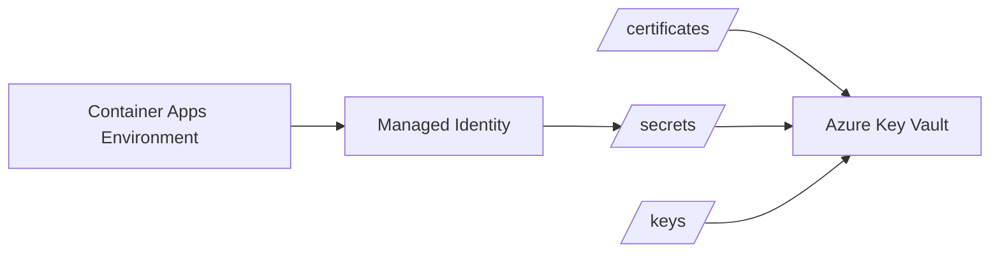

## Document Information

- **Azure CLI Version:** 2.80.0
- **PowerShell Version:** 7.6.0

## Overview

This guide describes how to configure an Azure Container Apps Environment to import a certificate from Azure Key Vault while following the principle of least privilege.

The solution grants the Container Apps Environment managed identity access to **only a single certificate's backing secret** rather than granting access to all secrets or certificates stored in the Key Vault.

## How Key Vault Stores Certificates

Azure Key Vault stores a certificate as a set of related resources rather than as a single object:

- **Certificate** stores the certificate metadata, policy, and lifecycle state.
- **Secret** stores the certificate payload that services typically download as PFX or PEM content.
- **Key** stores the cryptographic key when the certificate has an associated key in Key Vault.

In practice, these resources usually share the same logical certificate name, but they are exposed through different resource paths:

```text
/certificates/<certificate-name>
/secrets/<certificate-name>
/keys/<certificate-name>
```

For Azure Container Apps certificate import, the important detail is that the environment reads the certificate material from the **secret** resource, not from the certificate metadata resource.

<!-- markdownlint-capture -->
<!-- markdownlint-disable -->
> If a certificate exists in Key Vault, do not assume that access to the certificate resource automatically grants access to the certificate payload.
>
> For certificate import scenarios, always verify which underlying Key Vault resource the service reads.
{: .prompt-info }
<!-- markdownlint-restore -->

## Architecture



## Prerequisites

- Azure Container Apps Environment already exists.
- Azure Key Vault already exists.
- Certificate already exists in the Key Vault.
- Key Vault is configured to use **Azure RBAC** authorization.

## 1. Verify Key Vault Uses Azure RBAC

Verify that the Key Vault uses the Azure RBAC permission model instead of legacy access policies.

```powershell
az keyvault show `
  --name <key-vault-name> `
  --query properties.enableRbacAuthorization
```

## 2. Enable a System-Assigned Managed Identity

Enable a system-assigned managed identity on the Container Apps Environment.

```powershell
az containerapp env identity assign `
  --name <container-apps-environment-name> `
  --resource-group <resource-group-name> `
  --system-assigned
```

Retrieve the principal ID:

```powershell
$acaPrincipalId = az containerapp env show `
  --name <container-apps-environment-name> `
  --resource-group <resource-group-name> `
  --query identity.principalId `
  -o tsv

Write-Host $acaPrincipalId
```

## 3. Verify the Certificate's Backing Secret

Every Key Vault certificate has a corresponding secret containing the certificate's PFX payload.

Retrieve the secret identifier associated with the certificate:

```powershell
az keyvault certificate show `
  --vault-name <key-vault-name> `
  --name <certificate-name> `
  --query sid `
  -o tsv
```

## 4. Grant Access to Only the Certificate Secret

Assign the **Key Vault Secrets User** role directly to the certificate's backing secret.

```powershell
az role assignment create `
  --assignee-object-id $acaPrincipalId `
  --assignee-principal-type ServicePrincipal `
  --role "Key Vault Secrets User" `
  --scope "/subscriptions/<subscription-id>/resourceGroups/<resource-group-name>/providers/Microsoft.KeyVault/vaults/<key-vault-name>/secrets/<certificate-name>"
```

This grants only:

```text
Microsoft.KeyVault/vaults/secrets/getSecret/action
Microsoft.KeyVault/vaults/secrets/readMetadata/action
```

## 5. Verify Permissions

Verify the role assignment.

```powershell
az role assignment list `
  --assignee $acaPrincipalId `
  --all `
  --output table
```

Expected output:

```text
Role                  Scope
--------------------  -------------------------------------------------------------------------
Key Vault Secrets User .../vaults/<key-vault-name>/secrets/<certificate-name>
```

## 6. Import the Certificate into the Container Apps Environment

Import the certificate from Key Vault.

```powershell
az containerapp env certificate upload `
  --resource-group <resource-group-name> `
  --name <container-apps-environment-name> `
  --akv-url https://<key-vault-name>.vault.azure.net/certificates/<certificate-name>
```

## Benefits

- Access to exactly one certificate
- No access to other certificates
- No access to other secrets
- No Key Vault-wide permissions
- Least-privilege RBAC model
- Works with Azure Container Apps certificate import

## References

- [Manage certificates in Azure Container Apps](https://learn.microsoft.com/azure/container-apps/key-vault-certificates-manage)
- [Azure Key Vault RBAC guide](https://learn.microsoft.com/azure/key-vault/general/rbac-guide)
- [Azure Key Vault certificate access control](https://learn.microsoft.com/azure/key-vault/certificates/certificate-access-control)
